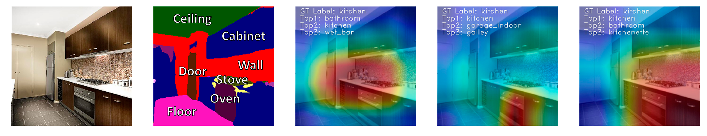
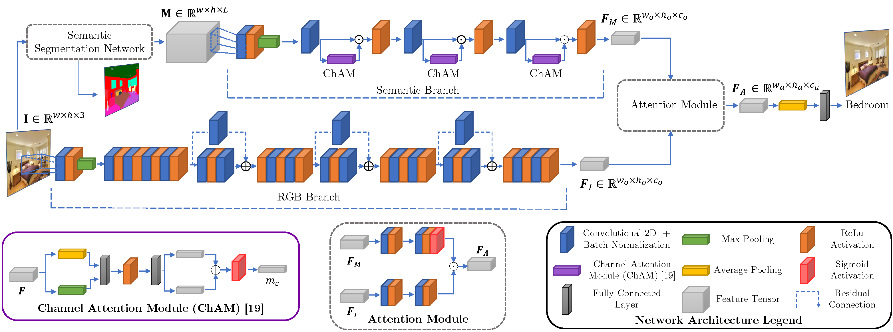

# Semantic-Aware Scene Recognition
Official Pytorch Implementation of [Semantic-Aware Scene Recognition](https://arxiv.org/abs/1909.02410) by Alejandro López-Cifuentes, Marcos Escudero-Viñolo, Jesús Bescós and Álvaro García-Martín.

This paper is currently under Peer Review Revision in Elsevier Pattern Recognition Journal.



## Summary
This paper propose to improve scene recognition by using object information to focalize learning during the training process. The main contributions of the paper are threefold: 

 - We propose an end-to-end multi-modal deep learning architecture which gathers both image and context information using a two-branched CNN architecture.
 - We propose to use semantic segmentation as an additional information source to automatically create, through a convolutional neural network, an attention model to reinforce the learning of relevant contextual information.
 - We validate the effectiveness of the proposed method through experimental results on public scene recognition datasets such as ADE20K, MIT Indoor 67, SUN 397 and Places365 obtaining state-of-the-art results.

The propose CNN architecture is as follows:


## Results
### ADE20K Dataset
| RGB  | Semantic | Top@1 | Top@2 | Top@5 | MCA |
|:--:|:--:|:--:|:--:|:--:|:--:|
| &#10003; |   | 55.90 | 67.25 | 78.00 | 20.96 |
|   | &#10003; | 50.60 | 60.45| 72.10 | 12.17 |
| **&#10003;** | **&#10003;** | **62.55** | **73.25** | **82.75** | **27.00** |

### MIT Indoor  67 Dataset
| Method | Backbone| Number of Parameters | Top@1 |
|--|:--:|:--:|:--:|
| PlaceNet | Places-CNN | 62 M | 68.24 |
| MOP-CNN | CaffeNet | 62 M | 68.90 |
| CNNaug-SVM | OverFeat | 145 M | 69.00 |
| HybridNet | Places-CNN | 62 M | 70.80 |
| URDL + CNNaug | AlexNet | 62 M | 71.90 |
| MPP-FCR2 | AlexNet | 62 M | 75.67 |
| DSFL + CNN (7 Scales) | AlexNet | 62M | 76.23 |
| MPP + DSFL | AlexNet | 62 M | 80.78 |
| CFV | VGG-19 | 62 M | 81.00 |
| CS | VGG-19 | 62 M | 82.24 |
| SDO (1 Scale) | 2 x VGG-19 | 62 M | 83.98 |
| VSAD | 2 x VGG-19 | 62 M | 86.20 |
| SDO (9 Scales) | 2 x VGG-19 | 62 M | 86.76 |
| Ours | ResNet-18 + Sem Branch + G-RGB-H | 47 M | 85.58 |
| **Ours*** | **ResNet-50 + Sem Branch + G-RGB-H** | **85 M** | **87.10** |

### SUN 397 Dataset
| Method | Backbone| Number of Parameters | Top@1 |
|--|:--:|:--:|:--:|
| Decaf | AlexNet | 62 M | 40.94 |
| MOP-CNN | CaffeNet | 62 M | 51.98 |
| HybridNet | Places-CNN | 62 M | 53.86 |
| Places-CNN | Places-CNN | 62 M | 54.23 |
| Places-CNN ft | Places-CNN | 62 M | 56.20 |
| CS | VGG-19 | 143 M | 64.53 |
| SDO (1 Scale) | 2 x VGG-19 | 276 M | 66.98 |
| VSAD | 2 x VGG-19 | 276 M | 73.00 |
| SDO (9 Scale) | 2 x VGG-19 | 276 M | 73.41 |
| Ours | ResNet-18 + Sem Branch + G-RGB-H | 47 M | 71.25 |
| **Ours*** | **ResNet-50 + Sem Branch + G-RGB-H** | **85 M** | **74.04** |

### Places 365 Dataset
| Network | Number of Parameters | Top@1 | Top@2 | Top@5 | MCA |
|--|:--:|:--:|:--:|:--:|:--:|
| AlexNet | 62 M | 47.45 | 62.33 | 78.39 | 49.15 |
| AlexNet* | 62 M | 53.17 | - | 82.59 | - |
| GooLeNet* | 7 M | 53.63 | - | 83.88 | - |
| ResNet-18 | 12 M | 53.05 | 68.87 | 83.86 | 54.40 |
| ResNet-50 | 25 M | 55.47 | 70.40 | 85.36 | 55.47 |
| ResNet-50* | 25 M | 54.74 | - | 85.08 | - |
| VGG-19* | 143 M | 55.24 | - | 84.91 | - |
| DenseNet-161 | 29 M | 56.12 | 71.48 | 86.12 | 56.12 |
| **Ours** | **47 M** | **56.51** | **71.57** | **86.00** | **56.51** |

## Setup
### Requirements
The repository has been tested in the following software versions.
 - Ubuntu 16.04
 - Python 3.6
 - Anaconda 4.6
 
### Clone Repository
Clone repository running the following command:

	$ git clone https://github.com/vpulab/Semantic-Aware-Scene-Recognition.git

### Anaconda Enviroment
To create and setup the Anaconda Envirmorent run the following terminal command from the repository folder:

    $ conda env create -f Config/Conda_Env.yml
    $ conda activate SA-Scene-Recognition

### Datasets
Download and setup instructions for each datasets are provided in the follwing links:

 - [ADE20K](https://github.com/alexlopezcifuentes/Semantic-Aware-Scene-Recognition/tree/master/Data/Datasets/ADEChallengeData2016)
 - [MIT Indoor 67](https://github.com/alexlopezcifuentes/Semantic-Aware-Scene-Recognition/tree/master/Data/Datasets/MITIndoor67)
 -  [SUN 397](https://github.com/alexlopezcifuentes/Semantic-Aware-Scene-Recognition/tree/master/Data/Datasets/SUN397)
 -  [Places 365](https://github.com/alexlopezcifuentes/Semantic-Aware-Scene-Recognition/tree/master/Data/Datasets/places365_standard)


## Evaluation

### Model Zoo
In order to evaluate the models independently, download them from the following links and indicate the path in YAML configuration files (Usually `/Data/Model Zoo/DATASET FOLDER`).

[**Recommended**] Alternatively you can run the following script from the repository folder to download all the available Model Zoo:

    bash ./Scripts/download_ModelZoo.sh

**ADE20K**
 - [Ours](https://dauam-my.sharepoint.com/:u:/g/personal/alejandro_lopezc01_estudiante_uam_es/EdjBkchzYmxMtemweugTNp8BAK_kzUmHwvFbmXgsE_VKRQ?download=1)
 - [RGB Branch](https://dauam-my.sharepoint.com/:u:/g/personal/alejandro_lopezc01_estudiante_uam_es/EY-boXwjIhZMq0LkaIqng48BY-ezHhF4t-0ctwOmSUYAjw?download=1)
 - [Semantic Branch](https://dauam-my.sharepoint.com/:u:/g/personal/alejandro_lopezc01_estudiante_uam_es/EYJ593CJEylMkRoyAO_UCWUBGKbUJIpGO_1VzeHeQYvBEA?download=1)

**MIT Indoor 67**
 - [Ours (ResNet-18 backbone)](https://dauam-my.sharepoint.com/:u:/g/personal/alejandro_lopezc01_estudiante_uam_es/EY5d6PU_Jo9ElazZpYvGn5cBI6aZChWQiyC3pXzey6L3cA?download=1)
 -  [Ours* (ResNet-50 backbone)](https://dauam-my.sharepoint.com/:u:/g/personal/alejandro_lopezc01_estudiante_uam_es/EdM4OL-XCzxLpX8YEQ02msUBeEV1Swax0u5Gws6TKtcibw?download=1)
 - [RGB Branch (ResNet-18 backbone)](https://dauam-my.sharepoint.com/:u:/g/personal/alejandro_lopezc01_estudiante_uam_es/EQfMFvxYdIFPmY6jJ4OPCssB8axLM9KyW7JWGIoOVkF0oQ?download=1)
 -  [RGB Branch* (ResNet-50 backbone)](https://dauam-my.sharepoint.com/:u:/g/personal/alejandro_lopezc01_estudiante_uam_es/EUR0-OHoGOZIhh5ae5mCiFEBnsXJ3EJe93Kb4KfPvUMmGQ?download=1)
 - [Semantic Branch](https://dauam-my.sharepoint.com/:u:/g/personal/alejandro_lopezc01_estudiante_uam_es/ETRa2iuWq-BKqyEKTnSY_VkBzsO2FbSZvTyav5fi5iDpug?download=1)

**SUN 397**
 - [Ours (ResNet-18 backbone)](https://dauam-my.sharepoint.com/:u:/g/personal/alejandro_lopezc01_estudiante_uam_es/EcNjUGAgE1dCss00_6A05_oBMjSUviEYigm0F_QcmW914g?download=1)
 - [Ours* (ResNet-50 backbone)](https://dauam-my.sharepoint.com/:u:/g/personal/alejandro_lopezc01_estudiante_uam_es/EZxsF-jz-lJJlKyDg0aJZp0BlKHiEa3vszzc5UYwuRCVSg?download=1)
 - [RGB Branch (ResNet-18 backbone)](https://dauam-my.sharepoint.com/:u:/g/personal/alejandro_lopezc01_estudiante_uam_es/ERFBOWinVolPuYkAjdipF00BHxeQ9mjzlO5Oc_x3NLzDdw?download=1)
 - [RGB Branch* (ResNet-50 backbone)](https://dauam-my.sharepoint.com/:u:/g/personal/alejandro_lopezc01_estudiante_uam_es/EehUiiT53QtAr_NF74Rlk7gB1xaBhvppctChoALhMS5cCg?download=1)
 - [Semantic Branch](https://dauam-my.sharepoint.com/:u:/g/personal/alejandro_lopezc01_estudiante_uam_es/EQxpscYkhY5Nh55sdSgaINkBcqSMZ9b32K8AbrDfUKO2_w?download=1)

**Places 365**
 - [Ours](https://dauam-my.sharepoint.com/:u:/g/personal/alejandro_lopezc01_estudiante_uam_es/Eco7I0NbpWFFpJdYjT1om38BX2aEBR1WXXzflE2YykT0qA?download=1)
 - [RGB Branch](https://dauam-my.sharepoint.com/:u:/g/personal/alejandro_lopezc01_estudiante_uam_es/EUaPpF5MpkNCqDd04GMVnYEB6BnH5inElN9ve_trAiWg-A?download=1)
 - [Semantic Branch](https://dauam-my.sharepoint.com/:u:/g/personal/alejandro_lopezc01_estudiante_uam_es/Ea_B3l8vdRtJg3fjhwm7KeIBCbDGV5L2MOtpo9E5GGBo3Q?download=1)
	
### Run Evaluation
In order to evaluate models run `evaluation.py` file from the respository folder indicating the dataset YAML configuration path:

    python evaluation.py --ConfigPath [PATH to configuration file]
    
Example for ADE20K Dataset:

    python evaluation.py --ConfigPath Config/config_ADE20K.yaml
    
All the desired configuration (backbone architecture to use, model to load, batch size...etc) should be changed in each separate YAML configuration file.
    
Computed performance metrics for both training and validation sets are:
 - Top@1
 - Top@2
 - Top@5
 - Mean Class Accuracy (MCA)


## Citation
If you find this work useful, please consider citing:
```
@article{lopez2019semantic,
  title={Semantic-Aware Scene Recognition},
  author={L{\'o}pez-Cifuentes, Alejandro and Escudero-Vi{\~n}olo, Marcos and Besc{\'o}s, Jes{\'u}s and Garc{\'\i}a, {\'A}lvaro},
  journal={arXiv preprint arXiv:1909.02410},
  year={2019}
}
```
## Acknowledgment
This study has been partially supported by the Spanish Government through its TEC2017-88169-R MobiNetVideo project.

